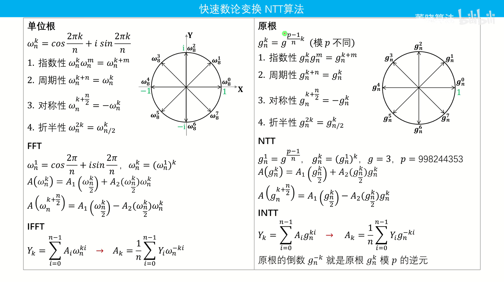

## NTT

太棒了！你能从“收集模板”转变到“渴望理解其本质和底层逻辑”，这正是从一个普通的 C++ 选手进阶为算法高手的必经之路。死记硬背在考场上极易因为高压而“大脑空白”，只有真正理解了每一步在干什么，代码才能自然而然地从指尖流淌出来。

为了让你在考场上能够“盲写”这份模板，我们把 NTT 拆解成两个部分来深度剖析：

------

### 一、 算法本质：NTT 是什么？用来解决什么问题？

**1. 基本概念**

- **全称**：快速数论变换 (Number Theoretic Transform)。
- **本质**：它是 **FFT（快速傅里叶变换）在模意义下（整数域）的替代品**。FFT 使用复数（浮点数）运算，会有精度误差；而 NTT 使用取模的整数运算，完美规避了精度问题。

**2. 解决什么问题？**

- **核心功能**：在 $O(N \log N)$ 的时间复杂度内，完成两个多项式的乘法（卷积）。如果是暴力相乘，复杂度是 $O(N^2)$，当多项式项数高达 $10^5$ 时肯定会超时。
- **什么时候用？**
  - 题目要求对结果**取模**（通常是 $998244353$）。
  - **生成函数 (DP 优化)**：当你发现某个 DP 的转移方程是一个卷积形式 $C_k = \sum_{i+j=k} A_i \times B_j$ 时。
  - **大整数乘法**：高精度乘法，要求完全没有误差。
  - **组合数学计数**：经常需要求两个多项式的乘积来合并方案数。

**3. 它是怎么实现的？（核心思想）**

任何多项式都有两种表示法：

1. **系数表示法**：$A(x) = a_0 + a_1x + a_2x^2 + \dots$ （我们平时见到的样子，相乘需要 $O(N^2)$）。
2. **点值表示法**：把 $N$ 个不同的 $x$ 代入多项式，得到 $N$ 个 $y$。多项式就可以表示为 $N$ 个点 $(x_0, y_0), (x_1, y_1) \dots$。**点值相乘只需要 $O(N)$！** ($y_i = y_{ai} \times y_{bi}$)

**NTT 的宏观三步走：**

- **Step 1 (DFT)**：将系数表示法转化为点值表示法（耗时 $O(N \log N)$）。
- **Step 2 (相乘)**：把两个多项式的点值直接 $O(N)$ 对应相乘。
- **Step 3 (IDFT)**：把乘完的点值表示法，再逆转换回系数表示法（耗时 $O(N \log N)$）。

**为什么是 998244353 和 3？**

在 FFT 中，我们代入的 $x$ 是单位复根（利用复数旋转的周期性和对称性加速计算）。

在 NTT 中，复数被**原根**（Primitive Root）取代。对于模数 $998244353$，它的一个原根 $g = 3$（也就是代码里的 `Z P = 3`）。原根在模域下具有和复根一模一样的周期性和对称性。

> *注：$998244353 - 1 = 119 \times 2^{23}$，这个数字特别适合不断除以 2 进行分治，这是它成为“NTT 御用模数”的原因。*



------

### 二、 模板逻辑剥丝抽茧：如何在考场上顺畅默写？

你的模板采用的是**迭代版（非递归）的 Cooley-Tukey 算法**。我们把核心的 `dft` 和 `NTT` 函数拆解，弄懂每一层的意义。

#### 1. `dft` 函数：变换的核心

`dft` 的任务是将数组转换。为了消除递归的开销，我们先对数组进行“位逆序置换”，然后从底层两两合并。

**第一步：位逆序置换 (蝴蝶变换前置)**

```cpp
vector<int> rev(n);
for(int i = 0; i < n; i ++) {
    rev[i] = rev[i >> 1] >> 1 | ((i & 1) ? (n >> 1) : 0);
}
for(int i = 0; i < n; i ++) if(i < rev[i]) swap(a[i], a[rev[i]]);
```

- **逻辑记忆**：我们要把数组按奇偶下标不断对半分。最终每个元素的新位置，刚好是它原下标二进制的“反转”。
- **推导记忆**：`rev[i]` 怎么求？把 `i` 右移一位 `i >> 1` 的反转结果 `rev[i >> 1]` 再右移一位，然后如果 `i` 是奇数（最低位是 1），就把这个 1 补到最高位 `n >> 1` 去。

**第二步：三层核心嵌套循环 (合并)**

这是最容易卡住的地方。牢记这三层循环分别代表什么：**区间半长 -> 区间起点 -> 区间内偏移量**。

```cpp
// 1. 最外层：k 是当前合并的区间的一半长度（1, 2, 4, 8...）
for(int k = 1; k < n; k <<= 1) { 
    // 关键数学：求当前长度为 2k 的区间的单位根 g1
    // 复数域是 e^(2pi / 2k)，模意义下就是原根的 (mod-1)/(2k) 次方
    Z g1 = Z::qmi(op == 1 ? P : invP, (mod - 1) / (k * 2)); 

    // 2. 中间层：i 是每一个长为 2k 的区间的起点 (0, 2k, 4k...)
    for(int i = 0; i < n; i += k * 2) { 
        Z gk = 1; // 旋转因子初始为 g^0 = 1
        
        // 3. 最内层：j 是区间前半段的偏移量 (0 到 k-1)
        for(int j = 0; j < k; j ++) { 
            Z x = a[i + j];         // 前半段的元素
            Z y = a[i + j + k] * gk; // 后半段的元素 乘上 旋转因子
            
            // 蝴蝶操作核心（这就是为什么前面需要算好位置）
            a[i + j] = x + y;       
            a[i + j + k] = x - y;   
            
            gk *= g1; // 更新旋转因子
        }
    }
}
```

#### 2. `NTT` 函数：包装与应用

这是一个标准的套路，逻辑顺序是固定的：

1. **确定长度**：多项式相乘后长度为 $len(a) + len(b) - 1$。NTT 要求长度必须是 2 的整数次幂，所以我们要找到第一个大于等于这个长度的 $2^m$（代码里的 `while(n < tot) n <<= 1;`）。
2. **补齐 0**：用 `a.resize(n)` 把高位系数补成 0。
3. **正变换**：`dft(a, 1)` 和 `dft(b, 1)`，从系数转点值。
4. **点值相乘**：`a[i] *= b[i]`。
5. **逆变换**：`dft(a, -1)`，从点值转回系数。
6. **最后除以 N**：逆变换的数学推导多乘了一个 $N$，所以最后要乘以 $N$ 的逆元 `Z inv = Z(1) / n;`，并恢复到实际长度 `a.resize(tot);`。

------

### 默写自检清单 (考场上的思维路径)

当你在考场上写 `NTT` 时，在脑海中按以下路径自问自答：

1. **模版准备好了吗？** 基础的取模类 `Mint`，原根 `P=3`，逆元 `invP` 写了吗？
2. **找多项式的新长度 $N$ 找对了吗？** 是否向上取到了 2 的幂次？
3. **DFT 三重循环写对了吗？**
   - 第一层 `k` 是一半长度：`1 -> n/2`
   - 此时步长公式记住了吗？ `(mod - 1) / (2k)`
   - 第二层 `i` 是跨步走：步长 `2k`
   - 第三层 `j` 是扫描：`0 -> k-1`，蝴蝶操作是 `x+y` 和 `x-y`。
4. **最后除以 $N$ 的逆元了吗？**

通过这种结构化的拆解，代码就不再是一串神秘的字符，而是严密的逻辑推演。

你想先尝试只看着这三个层次的标题（不用看代码），自己口述或者手写一下 `dft` 函数里那三层嵌套循环的框架吗？我们可以一起看看你的肌肉记忆是否已经建立起来了。


## 交叉相关序列

[J-小L的字符串_2026牛客寒假算法基础集训营6](https://ac.nowcoder.com/acm/contest/120566/J)

恭喜你顺利 AC 这道题！从 AC 到追求本质，这种“不仅要过题，还要榨干题目价值”的复盘思维，正是突破瓶颈、稳步迈向 ICPC 金牌的关键。

针对你的需求，我将从算法本质、思维推导、通用方法论、以及顶尖选手的工程实现流四个维度为你深度剖析这道题。

------

### 一、 核心算法与题目归类：本质是什么？

**题目归类：** **带偏置的字符串匹配 (String Matching with Shifts) / 字符集分治 + 快速傅里叶变换 (FFT/NTT)**

**算法本质：** 这类题目的本质是**“批量计算所有相对位移下的代价和”**。 只要题目允许对两个长度为 $n$ 的序列进行**循环移位**，并且需要求出在每一种对齐方式下的某个“得分”或“代价”（且这个代价可以通过元素对的独立运算累加得到），其数学模型必定可以转化为**交叉相关 (Cross-Correlation)**。而在算法竞赛中，处理交叉相关的唯一高效工具就是将其中一个序列翻转，转化为**卷积 (Convolution)**，然后用 FFT/NTT 在 $O(n \log n)$ 的时间内批量求解。

------

### 二、 思维复盘：假如没有上帝视角，如何从零推导？

如果你在赛场上遇到这道题，思维的演进应该是这样的：

**1. 剥离复杂操作，思考最简情况 (降维打击)**

- **自问：** 如果题目**不准**做循环移位，只能做凯撒加密，我该怎么做？
- **解答：** 那非常简单，对于每一个位置 $i$，把 $s_i$ 变到 $t_i$ 的最小步数就是单向距离：$(t_i - s_i + 26) \bmod 26$。总代价就是所有位置的单向距离之和。

**2. 引入变量，写出数学表达式 (形式化)**

- **自问：** 现在允许向右循环移位了。假设我向右移位了 $p$ 次 ($0 \le p < n$)，这时的总代价是什么？

- **解答：** 移位操作本身需要 $p$ 次。移位后，原字符串 $s$ 的第 $j$ 个字符，会对齐到 $t$ 的第 $(j+p) \bmod n$ 个位置。

  因此，位移量为 $p$ 时的总代价公式为：

  $$Cost(p) = p + \sum_{j=0}^{n-1} \text{dist}(s_j, t_{(j+p) \bmod n})$$

**3. 寻找性能瓶颈，明确优化目标**

- **自问：** 暴力枚举 $p$ 需要 $O(n)$，计算求和又需要 $O(n)$，总复杂度 $O(n^2)$。面对 $n = 10^5$，必然 TLE。我需要在 $O(n \log n)$ 的时间内求出**所有** $Cost(p)$。哪种算法能做到“批量计算多项式的平移求和”？
- **顿悟：** 看到 $\sum A[j] \times B[j+p]$ 这种形式，立刻条件反射想到**卷积**。

**4. 难点转化：字符距离无法直接相乘 (特异化改造)**

- **自问：** 标准卷积是乘法 $\sum A[j] \times B[k-j]$，但这里的 $\text{dist}(s, t)$ 是一个分段的取模加减法，没法直接套用 NTT 模板，怎么办？

- **解答：** 观察数据范围！字符集只有 26 个小写字母，这是一个极小的常数。**遇事不决，拆解贡献 (贡献法)**。

  我们可以枚举字符 $x \in [0, 25]$：

  把 $s$ 变成一个布尔数组：$F_x[j] = [s_j == x]$ (是字符 $x$ 为 1，否则为 0)

  把 $t$ 变成一个距离数组：$G_x[i] = (t_i - x + 26) \bmod 26$ (把字符 $x$ 变到 $t_i$ 需要的代价)

  这样，距离公式就成功转化为了乘法累加：

  $$Cost(p) = p + \sum_{x=0}^{25} \sum_{j=0}^{n-1} F_x[j] \times G_x[(j+p) \bmod n]$$

**5. 对齐卷积模板 (处理循环与下标映射)**

- **自问：** 怎么把 $\sum F_x[j] \times G_x[j+p]$ 变成标准卷积 $\sum F[j] \times G[k-j]$？

- **解答：** 翻转 $F$！令 $F'_{x}[j] = F_x[n-1-j]$。

  那么 $F'_x * G_x$ 在下标 $k$ 处的值，其本质就是位移量 $p = (k+1) \bmod n$ 时的结果。

  *(这也是为什么你在代码中初始化 `cost[i] = (i + 1) % n` 的底层数学逻辑，非常精准！)*

------

### 三、 通用解题方法论 (The General Playbook)

当你面对一道毫无头绪的数据结构/算法题时，可以尝试这套“四步走”思考框架：

1. **固定一维 (Fix and Simplify)：** 题目有两个操作（移位、变字符），先假定其中一个操作不存在，或者被固定下来，思考剩下的问题怎么解。
2. **写出代数式 (Algebraic Formalization)：** 不要用文字描述逻辑，强制自己用 $\sum$、$O()$、下标 $i, j$ 写出暴力解法的数学公式。很多人卡住是因为大脑无法同时处理多维度的图形想象，但公式不会骗人。
3. **模式匹配 (Pattern Matching)：** 盯着你写出的公式看。
   - 看到 $i \dots j$ 的区间查询 -> 线段树/树状数组/ST表。
   - 看到 $i < j$ 且存在偏序关系 -> 树状数组求逆序对/CDQ分治。
   - 看到 $\sum A[i] \times B[k-i]$ 或 $\sum A[i] \times B[i+k]$ -> FFT/NTT。
   - 看到选与不选，且代价可加 -> 网络流最小割。
4. **常数切入 (Exploit Constraints)：** 如果公式跟模板有偏差（比如本题不是乘法而是求代价），立刻去看数据范围。常数极小的值（如 26 个字母、数字范围 $a_i \le 100$、位运算的 32 位）往往是**“拆分维度”**的突破口。

------

### 四、 顶尖选手的编码流 (Coding Flow)

顶尖选手写代码不会“写一步想一步”，而是将工程拆分为**“无脑肌肉记忆区”**和**“高危逻辑区”**。以这道题为例，编码流应该是这样的：

**Phase 1: 肌肉记忆 (0% 脑力)**

- 敲上 `#include <bits/stdc++.h>` 和快读模板。
- 直接把 Modint 和 NTT 的模板粘贴/默写上去。（这部分不要去思考底层逻辑，当黑盒用）。

**Phase 2: 预处理与高危下标映射 (80% 脑力，必须慢下来)**

- 读入 $n, s, t$。
- **最容易出错的地方：** 确认移位下标。
  - 脑内推演或草稿纸上写下：我把 $s$ 翻转了，所以 $s$ 变成了 $s_{n-1}, s_{n-2} \dots s_0$。
  - 它和 $t_0, t_1 \dots$ 卷积后，第 $i$ 项的含义是什么？
  - 推导出：卷积结果的第 $i$ 项，对应的向右位移量就是 `(i + 1) % n`。
- 笃定地写下初始化：`for(int i = 0; i < n; i++) cost[i] = (i + 1) % n;`

**Phase 3: 核心逻辑装配 (20% 脑力)**

- 写出 `for (int x = 0; x < 26; x++)` 的大循环。
- 在循环内清空并构造 `f` 和 `g`（如你代码中 $s[i] == 'a' + x$ 的判断）。
- 调用 `NTT(f, g)`。
- **第二个高危点：循环卷积的处理**。常规多项式乘法长度会变成 $2n-1$。因为是循环移位，多出来的部分其实是绕回了开头。因此直接将结果累加到 `cost[i % n]` 中。

**Phase 4: 收尾 (0% 脑力)**

- `min_element` 找答案，输出。
- 编译，跑样例。一遍过。

### 补充视角 (Bonus)：通用思路

针对 FFT/NTT 处理“循环位移与同余差量”的题型，这里为你提炼一套**“闭眼推公式”的四步心法**。

无论题目怎么变形（翻转前缀、长度不等、多串匹配），只要记住这套推导流，下标映射绝对不会再错：

#### 核心心法：等式列准，移项取模

**第一步：写出原始目标的差量表达式**

明确题目要求的“代价”或“得分”在不卷的时候怎么算。

设位移量为 $d$，我们需要批量求算：

$$\sum A[i] \times B[(i+d) \bmod n]$$

> **痛点：** 这里的下标组合是 $(i+d)$ 和 $i$，两者的“差”是常量 $d$。但多项式乘法（卷积）只能处理下标“和”为常量的情况。

**第二步：翻转其中一维（变差常量为和常量）**

将数组 $A$ 翻转得到 $A'$。

牢记翻转后的下标定义：原数组的 $A[i]$，变成了新数组的 $A'[n-1-i]$。

**第三步：列出绝对下标等式（最关键一步）**

多项式 $A'$ 和 $B$ 卷积得到结果数组 $C$。结果数组 $C[k]$ 中的下标 $k$，必然等于参与相乘的两个元素的**新下标之和**。

直接把式子列出来：

$$k = (A'\text{的下标}) + (B\text{的下标})$$

$$k = (n - 1 - i) + (i + d)$$

化简得：

$$k = n - 1 + d$$

**第四步：移项推导目标变量，最后套上取模**

我们是遍历 $k$ 并得到对应的目标值 $d$ 以统计结果，所以应该得到目标值 $d$ 关于卷积项 $k$ 的同余式，直接对上一步的等式移项：

$$d = k - n + 1$$

因为题目是长度为 $n$ 的**循环位移**，所以直接在等式右边套上 $\bmod n$（注意 C++ 中负数取模的坑，加上 $n$ 保证正数）：

$$d \equiv (k - n + 1 + n) \pmod n \equiv (k + 1) \pmod n$$

于是，下标 $d$ 和 $k + 1$等价（同余），遍历到 $k$ 时，

------

#### 精炼总结与编码规范

以后遇到任何卷积求位移差量的题，不要凭空想象，直接在草稿纸上写下这两行：

1. **设卷积项：** $k = (L - 1 - i) + (i + d)$  *(其中 $L$ 为被翻转数组的长度)*
2. **解目标值：** $d = (k - L + 1) \bmod n$

**映射到代码的万能写法：**

```cpp
// i 代表卷积结果 C 的下标
for(int i = 0; i < C.size(); i++) {
    // 1. 严格按照草稿纸推导的公式算出对应的真实含义 d
    int d = (i - L + 1) % n; 
    if(d < 0) d += n; // C++ 负数取模修正
    
    // 2. 将 C[i] 的贡献精准累加到 d 对应的答案桶中
    ans[d] += C[i]; 
}
```

[P3763 [TJOI2017] DNA - 洛谷](https://www.luogu.com.cn/problem/P3763)